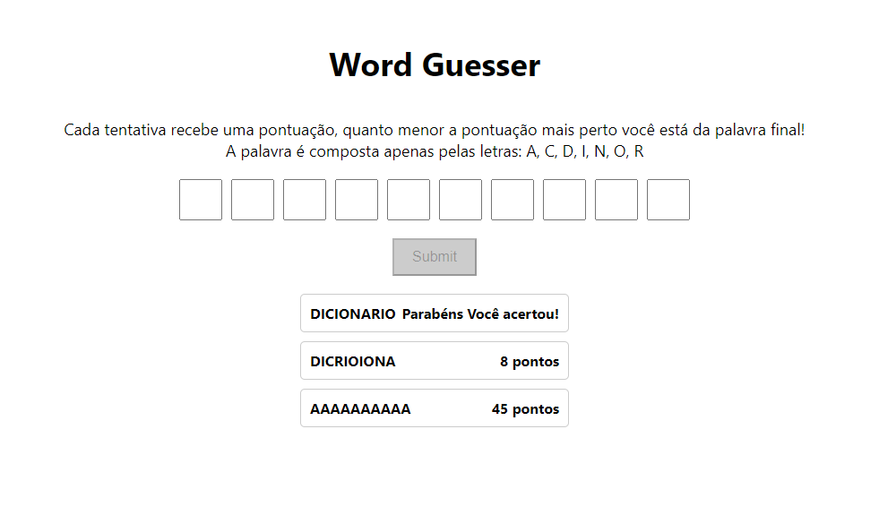

# Advinha palavra

## Apresentação
[Link da apresentação](https://www.youtube.com/watch?v=GcqZGe3XChE)

## Para rodar

### `npm install`

### `npm start`

há como rodar apenas o algoritmo usando o arquivo teste.js, alterar as entradas na linha 65 e rodar o comando:

### `node teste.js`
